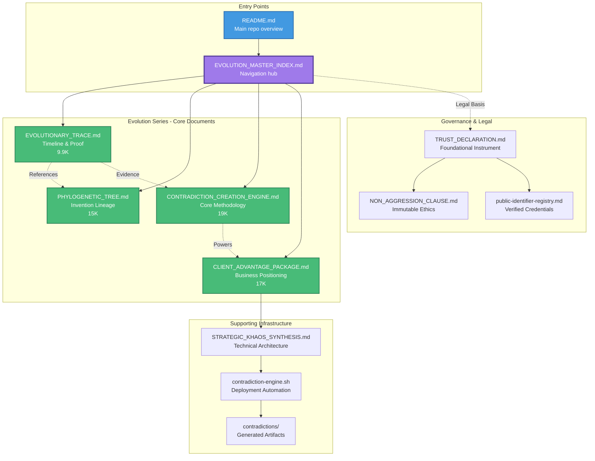

# Evolution Documentation Map



## Document Purpose & Relationships

### Primary Reading Flow

1. **Start Here**: `README.md` → Overview of entire DAO
2. **Navigate**: `EVOLUTION_MASTER_INDEX.md` → Choose your path
3. **Understand Evolution**: `EVOLUTIONARY_TRACE.md` → See the timeline
4. **Explore Lineage**: `PHYLOGENETIC_TREE.md` → Understand relationships
5. **Learn Methodology**: `CONTRADICTION_CREATION_ENGINE.md` → Master the loop
6. **Apply Business**: `CLIENT_ADVANTAGE_PACKAGE.md` → Competitive positioning

### Document Dependencies

```
EVOLUTION_MASTER_INDEX.md
├── References → EVOLUTIONARY_TRACE.md
├── References → PHYLOGENETIC_TREE.md
├── References → CONTRADICTION_CREATION_ENGINE.md
├── References → CLIENT_ADVANTAGE_PACKAGE.md
├── References → STRATEGIC_KHAOS_SYNTHESIS.md
└── References → contradiction-engine.sh
```

### Content Hierarchy

**Level 1: Foundation**
- Paradox Engine concept (Dec 1)
- "The wall IS the door. The constraint IS the fuel."

**Level 2: Evolution**
- Timeline: Dec 1-8, 2024
- Phases: Manual → Assisted → Automated → Unconscious

**Level 3: Implementation**
- Discord Bot Macro Refinery
- Red→Blue→Purple team synthesis
- Multi-AI orchestration

**Level 4: Business Application**
- 10 competitive advantages
- Revenue streams
- Client positioning

### Key Statistics

| Metric | Value |
|--------|-------|
| Total Documents | 5 core + 1 index |
| Total Size | 72K |
| Total Words | 9,255+ |
| Inventions Documented | 41+ |
| Generations Traced | 5 (Gen 0-4) |
| Contradictions Solved | 10+ formalized |
| Time Period | 8 days (Dec 1-8, 2024) |
| Evolution Proof | Unconscious competence achieved |

### Cross-References Matrix

|  | TRACE | TREE | ENGINE | CLIENT | INDEX |
|--|-------|------|--------|--------|-------|
| **TRACE** | - | ✓ | ✓ | ✓ | ✓ |
| **TREE** | ✓ | - | ✓ | - | ✓ |
| **ENGINE** | ✓ | ✓ | - | ✓ | ✓ |
| **CLIENT** | ✓ | - | ✓ | - | ✓ |
| **INDEX** | ✓ | ✓ | ✓ | ✓ | - |

Legend: ✓ = Document references this document

---

*This map shows the complete Evolution Documentation ecosystem and how all pieces connect.*
