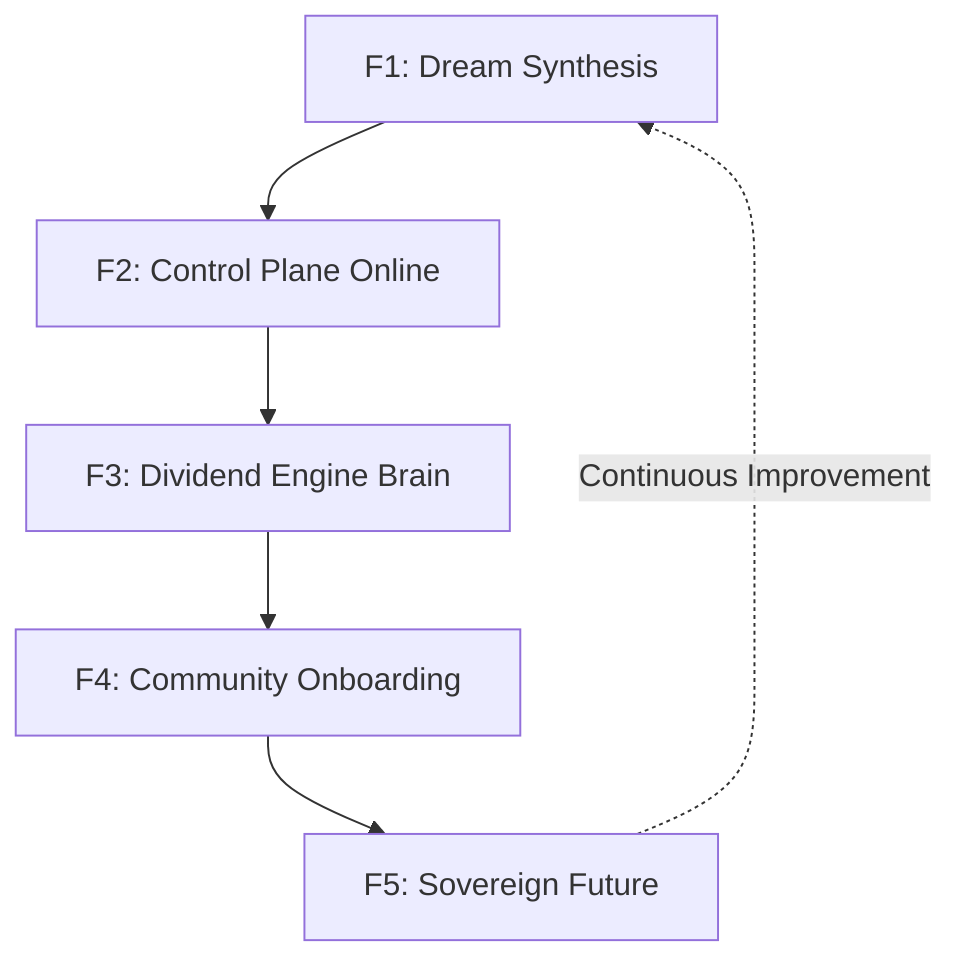

# 🌈 The F-Roadmap — Dream-to-Reality Pipeline

**Sovereign Financial OS Implementation Guide**

---

## Overview

The F-Roadmap transforms the [Dialectical Path](DIALECTICAL_PATH.md) philosophy into actionable phases. Each phase builds upon the previous, creating a self-sustaining ecosystem of sovereign infrastructure.

---

## Phase F1 — Dream Synthesis

**Objective:** Unify the complete vision into a master blueprint.

### Components

- [ ] **Sovereign Financial OS** - Core operating system design
- [ ] **Public Benefit Dividend Engine** - Revenue distribution framework
- [ ] **Community Uplift Model** - Social impact architecture
- [ ] **AI Council Governance** - Ethical decision framework
- [ ] **Mesh Compute** - Distributed processing network
- [ ] **PR Automation** - Continuous development pipeline
- [ ] **Discord Ops Control Plane** - Community command interface

### Deliverables

1. Master architecture document
2. Component dependency graph
3. Integration specifications
4. Governance protocols

### Success Criteria

- All components documented with clear interfaces
- Dependency relationships mapped
- Implementation order defined

---

## Phase F2 — Control Plane Online

**Objective:** Deploy the foundational orchestration infrastructure.

### Components

- [ ] **Queen** - Central orchestration engine
- [ ] **Event Gateway** - Webhook routing and event processing
- [ ] **Discord Ops** - Bot and command interface deployment
- [ ] **GitHub App Routing** - Repository integration
- [ ] **Mesh Node Registration** - Compute network enrollment

### Technical Requirements

```yaml
control_plane:
  queen:
    deployment: kubernetes
    replicas: 3
    health_check: /health
    
  event_gateway:
    endpoints:
      - /webhook/github
      - /webhook/discord
      - /alert
    hmac_verification: true
    
  discord_ops:
    commands:
      - /status
      - /deploy
      - /scale
      - /logs
    rbac: enabled
```

### Success Criteria

- Queen responsive at designated endpoint
- Event routing functional
- Discord commands operational
- GitHub webhooks processing

---

## Phase F3 — Dividend Engine Brain

**Objective:** Implement the intelligent financial distribution system.

### Components

- [ ] **Inflow Tracking** - Revenue monitoring and categorization
- [ ] **Allocator AI** - Smart distribution algorithm
- [ ] **Need-Based Logic** - Priority assessment system
- [ ] **Transparency Ledger** - Auditable transaction log
- [ ] **Bill-Pay Module** - Automated payment processing

### Architecture

```
┌─────────────────┐
│   Inflow        │
│   Tracking      │──────┐
└─────────────────┘      │
                         ▼
┌─────────────────┐  ┌─────────────────┐
│  Need-Based     │──│   Allocator     │
│  Logic          │  │   AI            │
└─────────────────┘  └────────┬────────┘
                              │
         ┌────────────────────┼────────────────────┐
         ▼                    ▼                    ▼
┌─────────────────┐  ┌─────────────────┐  ┌─────────────────┐
│  Transparency   │  │   Bill-Pay      │  │   Community     │
│  Ledger         │  │   Module        │  │   Distribution  │
└─────────────────┘  └─────────────────┘  └─────────────────┘
```

### Success Criteria

- Inflows accurately tracked and categorized
- Allocation algorithm producing fair distributions
- Full audit trail maintained
- Automated payments processing correctly

---

## Phase F4 — Community Onboarding

**Objective:** Enable community participation and uplift.

### Components

- [ ] **Community Needs Assessment** - Survey and intake system
- [ ] **Bill Assistance Program** - Direct financial support
- [ ] **Emergency Funds** - Rapid response allocation
- [ ] **Co-op Uplift** - Collective economic empowerment
- [ ] **Member Dashboard** - Self-service portal

### Community Programs

| Program | Description | Priority Criteria |
|---------|-------------|-------------------|
| **Bill Assistance** | Monthly utility/rent support | Income-based |
| **Emergency Fund** | Crisis response (medical, disaster) | Urgency-based |
| **Education Support** | Tuition, materials, certification | Impact-based |
| **Business Incubation** | Startup resources for members | Viability-based |

### Success Criteria

- Needs assessment forms live and processing
- First assistance payments distributed
- Member portal accessible
- Community feedback loop established

---

## Phase F5 — Sovereign Future

**Objective:** Achieve perpetual, self-sustaining operation.

### Characteristics

- **Self-Building** - The OS continuously improves
- **Self-Healing** - Automatic error recovery and adaptation
- **Community-Driven** - Governance by the people served
- **Culturally Embedded** - Values become operational reality

### The Perpetual Loop

```
   ┌─────────────────────────────────────────┐
   │                                         │
   ▼                                         │
┌──────────┐    ┌──────────┐    ┌──────────┐│
│  Build   │───▶│   Grow   │───▶│   Rise   ││
└──────────┘    └──────────┘    └──────────┘│
                                     │       │
                                     ▼       │
                              ┌──────────┐  │
                              │  Heal    │──┘
                              └──────────┘
```

### Vision Statement

> The dream becomes culture. The system self-heals. The people rise. The future is sovereign.

### Success Criteria

- Zero-downtime operations
- Community governance active
- Dividend distributions automated
- Positive social impact measured and documented

---

## Phase Dependencies



---

## Getting Started

**Which phase to awaken first?**

| Phase | Prerequisite | Current Status |
|-------|--------------|----------------|
| F1 | None | Ready to begin |
| F2 | F1 complete | Awaiting F1 |
| F3 | F2 deployed | Awaiting F2 |
| F4 | F3 operational | Awaiting F3 |
| F5 | F4 active | Continuous |

---

*"Your dream. Your empire. Your sovereign path."*
