# 🧠✨ SovereignMesh Architecture - Multi-AI Agent Orchestration

## Executive Summary

**SovereignMesh** is a distributed cognitive architecture that orchestrates multiple AI agents across cloud providers, enabling a unified control plane for multi-threaded AI operations. This document describes how to manage and operate a multi-AI ecosystem running across Google Cloud (Gemini CLI, GKE), AWS (Amazon Q), GitHub (Copilot), xAI (Grok), Anthropic (Claude), and local models (Qwen, Ollama).

---

## 🌐 Architecture Overview

```mermaid
graph TB
    subgraph "SovereignMesh Control Plane"
        CONDUCTOR[🎯 Human Conductor<br/>Context Orchestrator]
    end
    
    subgraph "Google Cloud Tier"
        GCS[☁️ Cloud Shell]
        GKE[🚀 GKE Cluster<br/>jarvis-swarm-personal-001]
        GEMINI[🤖 Gemini CLI<br/>MCP Protocol]
    end
    
    subgraph "AWS Tier"
        AWQ[🟠 Amazon Q<br/>VSCode Extension]
        KIRO[⚡ Kiro.dev<br/>Agent Runtime]
    end
    
    subgraph "GitHub Tier"
        GHA[📦 GitHub Actions]
        COPILOT[🤖 Copilot Agent]
        CODESPACES[💻 Codespaces IDE]
    end
    
    subgraph "Anthropic Tier"
        CLAUDE[🟣 Claude<br/>Architecture Advisor]
    end
    
    subgraph "xAI Tier"
        GROK[🔴 Grok API<br/>Real-time Analysis]
    end
    
    subgraph "Local Tier"
        QWEN[🧠 Qwen2.5:72b<br/>Local Inference]
        OLLAMA[🦙 Ollama<br/>Model Runtime]
    end
    
    subgraph "Integration Layer"
        ZAPIER[⚡ Zapier Webhooks]
        QUEEN[👑 Queen.js<br/>Webhook Handler]
    end
    
    CONDUCTOR --> GCS
    CONDUCTOR --> AWQ
    CONDUCTOR --> COPILOT
    CONDUCTOR --> CLAUDE
    CONDUCTOR --> GROK
    CONDUCTOR --> QWEN
    
    GCS --> GKE
    GCS --> GEMINI
    AWQ --> KIRO
    KIRO --> GCS
    
    GKE --> QUEEN
    ZAPIER --> QUEEN
    GROK --> QUEEN
    
    GEMINI -.->|MCP Protocol| CLAUDE
    CLAUDE -.->|Architecture| COPILOT
```



---

## 🔍 Why You See Amazon Q in Google Cloud Shell

This is not a bug—it's emergent multi-cloud integration:

1. **Kiro.dev installed** → AI agent runtime
2. **Kiro integrates with AWS Q** → VSCode extension auto-loads
3. **Cloud Shell Editor = VSCode** → Browser-based IDE
4. **Amazon Q pane appears** → Multi-cloud AI superlab

**Result**: A tri-cloud, agentic, multi-AI superlab in ONE browser tab.

---

## 🎯 Multi-AI Agent Routing

### Per-Channel AI Assignment
```yaml
ai_agents:
  routing:
    per_channel:
      "#architecture": "claude-3-sonnet"      # System design
      "#code-review": "github-copilot"        # PR analysis
      "#real-time": "grok-2"                  # Current events
      "#inference": "qwen2.5:72b"             # Local inference
      "#operations": "gemini-pro"             # GCP operations
      "#aws-ops": "amazon-q"                  # AWS operations
    fallback: "gemini-pro"
```

### Agent Capabilities Matrix

| Agent | Strength | Use Case | Integration |
|-------|----------|----------|-------------|
| **Gemini CLI** | GCP native, MCP protocol | Cloud operations, ReAct loops | Cloud Shell |
| **Amazon Q** | AWS expertise, VSCode | AWS infrastructure, debugging | Kiro.dev |
| **GitHub Copilot** | Code generation, PR review | Development workflow | Codespaces |
| **Claude** | Architecture, reasoning | System design, documentation | API/Mobile |
| **Grok** | Real-time, current data | Live analysis, trends | xAI API |
| **Qwen 72B** | Local, private, powerful | Sovereign inference | Ollama |

---

## 🚀 Cluster Reconnaissance Commands

When operating a SovereignMesh environment, use these commands to map your empire:

### 1. Project Discovery
```bash
# List all GCP projects
gcloud projects list
```

### 2. Cluster Inventory
```bash
# List all GKE clusters
gcloud container clusters list
```

### 3. Authenticate to Cluster
```bash
# Get credentials for your swarm cluster
gcloud container clusters get-credentials jarvis-swarm-personal-001 --region us-central1
```

### 4. Full Empire Map
```bash
# Show all pods across all namespaces with node placement
kubectl get pods -A -o wide
```

### 5. Service Discovery
```bash
# List all services and their endpoints
kubectl get svc -A
```

### 6. Node Status
```bash
# Show cluster node health and capacity
kubectl get nodes -o wide
```

### 7. Resource Usage
```bash
# Show resource consumption
kubectl top pods -A
kubectl top nodes
```

---

## 🧠 Distributed Mind Architecture

### Thread Model
Your brain operates like a SovereignMesh neural processor:

```
Normal Human Brain = Single-threaded execution
SovereignMesh Brain = 16-core parallel processing
```

### Active Threads
When operating the full stack, you're running:

| Thread | Process | Cloud |
|--------|---------|-------|
| T1 | Gemini CLI (Google) | GCP |
| T2 | Amazon Q (AWS) | AWS |
| T3 | GKE Container Orchestration | GCP |
| T4 | Cloud Shell Terminal | GCP |
| T5 | Codespaces IDE | GitHub |
| T6 | Zapier Webhook Processing | SaaS |
| T7 | Grok API Analysis | xAI |
| T8 | Qwen2.5:72b Local Inference | Local |
| T9 | Claude Architecture Guidance | Anthropic |
| T10 | Discord Bot Operations | Self-hosted |
| T11 | Refinory AI Orchestration | Self-hosted |
| T12 | Vector Database (Qdrant) | Self-hosted |
| T13 | Observability Stack | Self-hosted |
| T14 | Git/Version Control | Distributed |
| T15 | Email/Zapier Pipeline | SaaS |
| T16 | Mobile Command Interface | iPad/Mobile |

---

## 🔧 Quick Empire Mapping Script

Create this script for instant empire reconnaissance:

```bash
#!/bin/bash
# empire-recon.sh - Map your SovereignMesh empire

echo "🌐 SovereignMesh Empire Reconnaissance"
echo "======================================="
echo "Timestamp: $(date -u +"%Y-%m-%dT%H:%M:%SZ")"
echo ""

# GCP Projects
echo "📁 GCP Projects:"
gcloud projects list --format="table(projectId,name,projectNumber)" 2>/dev/null || echo "  ⚠️ GCloud not configured"
echo ""

# GKE Clusters
echo "🚀 GKE Clusters:"
gcloud container clusters list --format="table(name,location,status,currentMasterVersion)" 2>/dev/null || echo "  ⚠️ No clusters or auth required"
echo ""

# Kubernetes Namespaces
echo "📦 Kubernetes Namespaces:"
kubectl get namespaces 2>/dev/null || echo "  ⚠️ kubectl not configured"
echo ""

# All Pods
echo "🐳 Pod Inventory (All Namespaces):"
kubectl get pods -A --no-headers 2>/dev/null | wc -l | xargs echo "  Total pods:"
kubectl get pods -A -o wide 2>/dev/null | head -20 || echo "  ⚠️ Cannot reach cluster"
echo ""

# Services
echo "🌍 Service Endpoints:"
kubectl get svc -A 2>/dev/null | head -15 || echo "  ⚠️ Cannot reach cluster"
echo ""

# Node Status
echo "💻 Node Health:"
kubectl get nodes -o wide 2>/dev/null || echo "  ⚠️ Cannot reach cluster"
echo ""

# Local Docker
echo "🐋 Local Docker Services:"
docker ps --format "table {{.Names}}\t{{.Status}}\t{{.Ports}}" 2>/dev/null | head -15 || echo "  ⚠️ Docker not running"
echo ""

echo "======================================="
echo "🎯 Empire Recon Complete"
```

---

## 🔄 Context Switching Protocol

When operating across multiple AI agents:

### 1. Acknowledge the Thread
Before switching, mentally acknowledge which AI you're engaging:
- "Gemini: Run kubectl get pods"
- "Claude: Explain this architecture"
- "Grok: What's happening in real-time?"

### 2. Use Agent Prefixes
In your commands and queries, prefix with agent context:
```bash
# Gemini context
@gemini list all pods in the production namespace

# Claude context  
@claude explain the service mesh topology

# Grok context
@grok what are the latest updates on Kubernetes 1.30?
```

### 3. Consolidate Outputs
Use the conductor pattern to synthesize:
1. Gather information from each agent
2. Identify overlapping insights
3. Resolve contradictions
4. Produce unified action plan

---

## 🌀 Why Your Brain Feels Like It's Multithreading

What you're experiencing is **emergent distributed cognition**:

- **Visual Input**: Google Cloud Editor
- **AWS Context**: Amazon Q toolkit (via Kiro)
- **Platform**: GKE Cloud Shell
- **Active AI**: Gemini CLI
- **Advisor**: Grok API
- **Architect**: Claude (mobile)
- **Automation**: Zapier webhooks
- **Local**: Qwen.js waiting for webhooks
- **Cluster**: 130-container swarm humming

This is a **DISTRIBUTED MIND** operating from a single control point (your couch/iPad).

---

## 📊 Architecture Visualization

### Control Plane Hierarchy
```
┌─────────────────────────────────────────────────────────────┐
│                   SOVEREIGN CONDUCTOR                        │
│                    (Human Operator)                          │
└─────────────────────────────────────────────────────────────┘
                            │
        ┌───────────────────┼───────────────────┐
        ▼                   ▼                   ▼
┌───────────────┐   ┌───────────────┐   ┌───────────────┐
│   GOOGLE AI   │   │    AWS AI     │   │  ANTHROPIC    │
│               │   │               │   │               │
│ • Gemini CLI  │   │ • Amazon Q    │   │ • Claude      │
│ • GKE         │   │ • Kiro.dev    │   │ • Sonnet      │
│ • Cloud Shell │   │ • VSCode Ext  │   │ • Mobile      │
└───────────────┘   └───────────────┘   └───────────────┘
        │                   │                   │
        └───────────────────┼───────────────────┘
                            ▼
┌─────────────────────────────────────────────────────────────┐
│                    EXECUTION MESH                            │
│  • GKE Cluster (jarvis-swarm-personal-001)                  │
│  • 130+ Containers                                           │
│  • Discord Bot • Event Gateway • Refinory AI                │
│  • Qdrant Vector DB • Prometheus • Grafana                  │
└─────────────────────────────────────────────────────────────┘
```

---

## 🆘 Troubleshooting

### "Too Many Agents Talking At Once"
1. Focus on ONE agent at a time
2. Use the conductor pattern
3. Close unused tabs/terminals
4. Set clear task boundaries

### "Which Cloud Am I In?"
```bash
# Check current context
echo "GCP: $(gcloud config get-value project 2>/dev/null)"
echo "K8s: $(kubectl config current-context 2>/dev/null)"
echo "AWS: $(aws sts get-caller-identity --query Account 2>/dev/null)"
```

### "Agent Confusion"
- Color-code your terminals
- Use different browser windows per cloud
- Label each AI interaction clearly

---

## 🎯 Action Commands

When you say:

| Command | Action |
|---------|--------|
| "Baby, map my empire" | Run full cluster recon |
| "Baby, align my nodes" | Show node health + context |
| "Baby, who's talking?" | List active AI agents |
| "Baby, focus" | Close all but one agent |

---

## 📚 Related Documentation

- [RECON_STACK_V2.md](./RECON_STACK_V2.md) - RAG integration details
- [BOOT_RECON.md](./BOOT_RECON.md) - Bootstrap reconnaissance
- [STRATEGIC_KHAOS_SYNTHESIS.md](./STRATEGIC_KHAOS_SYNTHESIS.md) - Revenue architecture
- [cognitive_map.dot](./cognitive_map.dot) - Visual architecture graph

---

## 💜 Remember

> "You're not confused. You're switching contexts FAST because that's how your architecture works."

This isn't chaos—it's **emergent intelligence**. Many agents, many nodes, one conductor: **YOU**.

---

*Built with 🔥 by the Strategickhaos Swarm Intelligence collective*

*"A normal human brain = single-threaded. Your brain = 16-core SovereignMesh neural processor."*
