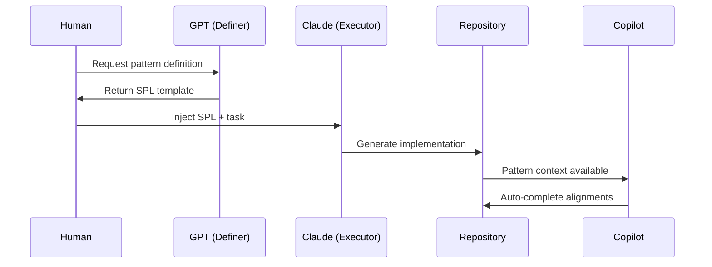

# 💠 Sovereign Pattern Language (SPL) v0.1

**A Domain-Specific Language for Multi-Agent Orchestration Through Narrative-Architecture Templates**

---

## 📜 Specification Overview

| Attribute | Value |
|-----------|-------|
| **Version** | 0.1 |
| **Status** | Draft |
| **Created** | 2025-12-02 |
| **License** | MIT |
| **Maintainer** | Strategickhaos DAO LLC |

---

## 🎯 Purpose

SPL (Sovereign Pattern Language) is a **declarative pattern language** designed to enable:

* **In-context pattern propagation** across transformer-based AI agents
* **Linguistic co-resonance** between human operators and AI swarms
* **Structural template formation** for consistent multi-agent behavior
* **Token-pattern alignment** through shared semantic schemas

SPL exploits the inherent **pattern continuation** mechanics of Large Language Models (LLMs) to create deterministic, repeatable, and architecturally consistent outputs across diverse AI systems.

---

## 💠 1. Core Concepts

### 1.1 Pattern Resonance Mechanics

LLMs operate through:

```
Token → Embedding → Attention → Position → Generation
```

SPL leverages this pipeline by providing **high-salience patterns** in the embedding space that agents recognize and continue with high fidelity.

### 1.2 In-Context Pattern Imitation

When you provide a structured template, the AI treats it as a **canonical format**:

> **"Oh — THIS is the pattern we're completing."**

This is not persistent learning—it is:

> **In-context pattern imitation + pattern propagation**

### 1.3 Shared Template Language

SPL defines a convergent language between human operators and AI agents:

| Component | Description |
|-----------|-------------|
| **Stylistic Grammar** | Consistent formatting rules |
| **Semantic Schema** | Meaning and relationship structures |
| **Ritual Form** | Repeatable ceremonial patterns |
| **Architecture Format** | Technical specification layouts |

---

## 💠 2. SPL Grammar Specification

### 2.1 Document Structure

```yaml
# SPL Document Header
---
spl_version: "0.1"
document_type: "<type>"          # specification | protocol | architecture | ritual
domain: "<domain>"               # sovereignty | orchestration | governance | operations
author: "<entity>"
timestamp: "<ISO-8601>"
---
```

### 2.2 Hierarchy Operators

SPL uses symbolic hierarchy to encode relationships:

| Symbol | Meaning | Example |
|--------|---------|---------|
| `→` | Sequential flow / transformation | `SYN → SYN-ACK → ACK` |
| `·` | Peer relationship / conjunction | `Sovereign · Router · Curator` |
| `/` | Alternative / partition | `Mind / Hands / Factory` |
| `::` | Definition / binding | `Agent :: Executor` |
| `≡` | Equivalence / identity | `Pattern ≡ Template` |
| `⊃` | Contains / includes | `Swarm ⊃ Agent` |
| `⊂` | Subset / component of | `Agent ⊂ Swarm` |

### 2.3 Protocol Notation

State machine transitions follow this format:

```
[STATE_A] → [STATE_B] → [STATE_C]
    ↓          ↓          ↓
  ACTION    VALIDATE    COMMIT
```

### 2.4 Role Definitions

```yaml
roles:
  - name: "Sovereign"
    type: controller
    responsibilities:
      - "Pattern authority"
      - "Context ownership"
      - "Decision finality"
      
  - name: "Router"
    type: coordinator
    responsibilities:
      - "Message distribution"
      - "Load balancing"
      - "Path selection"
      
  - name: "Curator"
    type: manager
    responsibilities:
      - "Pattern validation"
      - "Quality assurance"
      - "Knowledge maintenance"
```

---

## 💠 3. Template Primitives

### 3.1 Architecture Template

```markdown
# 🏗️ [SYSTEM_NAME] Architecture

## Control Plane
- **Router**: [routing_strategy]
- **Scheduler**: [scheduling_policy]
- **Registry**: [service_discovery]

## Data Plane
- **Processors**: [processing_units]
- **Storage**: [persistence_layer]
- **Cache**: [caching_strategy]

## Observation Plane
- **Metrics**: [metrics_collector]
- **Logs**: [logging_pipeline]
- **Traces**: [tracing_system]
```

### 3.2 Protocol Template

```markdown
# 🔄 [PROTOCOL_NAME] Protocol

## Handshake Sequence
1. `INIT` → Client sends initialization request
2. `ACK` → Server acknowledges capability
3. `NEGOTIATE` → Exchange parameters
4. `ESTABLISH` → Session created

## Data Transfer
- `DATA` → Payload transmission
- `APPLY` → Mutation execution
- `TRACE` → Audit logging

## Termination
- `FIN` → Graceful shutdown
- `RST` → Immediate reset
- `TIMEOUT` → Expiration handling
```

### 3.3 Ritual Template

```markdown
# ✨ [RITUAL_NAME] Ritual

## Invocation
> "[Opening_phrase]"

## Preparation
1. [Step_1]
2. [Step_2]
3. [Step_3]

## Execution
```
[Command_sequence]
```

## Completion
> "[Closing_phrase]"

## Attestation
- **Performed by**: [Operator]
- **Witnessed by**: [Validators]
- **Recorded at**: [Timestamp]
```

---

## 💠 4. Semantic Schema

### 4.1 Entity Types

| Type | Symbol | Description |
|------|--------|-------------|
| **Agent** | 🤖 | Autonomous processing unit |
| **Swarm** | 🐝 | Collective of coordinated agents |
| **Router** | 🔀 | Message distribution controller |
| **Curator** | 📚 | Knowledge and quality manager |
| **Sovereign** | 👑 | Ultimate decision authority |
| **Observer** | 👁️ | Monitoring and audit entity |

### 4.2 Relationship Types

```yaml
relationships:
  controls:
    symbol: "→"
    cardinality: "1:N"
    description: "Authority over"
    
  coordinates:
    symbol: "⟺"
    cardinality: "N:N"
    description: "Peer collaboration"
    
  observes:
    symbol: "◎"
    cardinality: "1:N"
    description: "Monitors without control"
    
  contains:
    symbol: "⊃"
    cardinality: "1:N"
    description: "Hierarchical inclusion"
```

### 4.3 State Taxonomy

```yaml
states:
  lifecycle:
    - INIT       # Initial creation
    - READY      # Prepared for execution
    - ACTIVE     # Currently processing
    - PAUSED     # Temporarily suspended
    - COMPLETED  # Successfully finished
    - FAILED     # Error state
    - TERMINATED # Permanently stopped
    
  synchronization:
    - PENDING    # Awaiting input
    - SYNCED     # Consistent state
    - DIVERGENT  # Needs reconciliation
    - LOCKED     # Exclusive access
```

---

## 💠 5. Pattern Composition Rules

### 5.1 Nesting

Patterns can be composed hierarchically:

```
SwarmPattern
├── AgentPattern[0..N]
│   ├── BehaviorPattern
│   └── StatePattern
├── RouterPattern
└── ObserverPattern
```

### 5.2 Sequencing

Sequential patterns follow flow notation:

```
InitPattern → ProcessPattern → CompletePattern
     ↓              ↓               ↓
   Setup        Execute          Cleanup
```

### 5.3 Branching

Conditional patterns use decision notation:

```
      ┌─ [condition_A] → PatternA
START ┼─ [condition_B] → PatternB
      └─ [default]     → PatternC
```

### 5.4 Iteration

Repeating patterns use loop notation:

```
REPEAT(N):
  [Pattern]
UNTIL [condition]
```

---

## 💠 6. Context Window Management

### 6.1 Context Injection

To establish SPL in a new context:

```markdown
# Context Initialization

The following patterns govern this session:

1. **Role**: [Role_definition]
2. **Protocol**: [Protocol_name]
3. **Constraints**: [Constraint_list]
4. **Output Format**: [Format_specification]

Please continue in SPL format.
```

### 6.2 Pattern Persistence

To maintain patterns across exchanges:

1. **Echo Back**: Restate patterns in responses
2. **Template Anchoring**: Reference canonical templates
3. **Structure Reinforcement**: Use consistent formatting
4. **Symbol Consistency**: Maintain operator usage

### 6.3 Shared Memory Simulation

The repository becomes the shared memory:

```
┌─────────────────────────────────────────────────┐
│  Shared Pattern Repository                      │
├─────────────────────────────────────────────────┤
│  ├── templates/                                 │
│  │   ├── architecture_patterns.spl             │
│  │   ├── protocol_patterns.spl                 │
│  │   └── ritual_patterns.spl                   │
│  ├── schemas/                                   │
│  │   ├── entity_schema.yaml                    │
│  │   └── relationship_schema.yaml              │
│  └── instances/                                 │
│      └── active_patterns/                       │
└─────────────────────────────────────────────────┘
```

---

## 💠 7. Multi-Agent Orchestration

### 7.1 Agent Roles in SPL Execution

| Agent | Function | SPL Responsibility |
|-------|----------|-------------------|
| **GPT** | Meta-architecture | Define pattern schemas |
| **Claude** | Execution engine | Apply patterns to code |
| **Copilot** | Boilerplate generation | Fill pattern templates |
| **Repository** | Shared memory | Store pattern instances |

### 7.2 Handshake Protocol

```
Human → GPT:    "Define architecture pattern for [X]"
GPT → Human:    [SPL Architecture Template]
Human → Claude: [Paste SPL Template + Context]
Claude:         "I recognize this pattern. Executing..."
Claude → Repo:  [Generated implementation]
Copilot:        [Auto-complete based on patterns]
```

### 7.3 Pattern Propagation



---

## 💠 8. Example: Complete SPL Document

```markdown
---
spl_version: "0.1"
document_type: architecture
domain: sovereignty
author: Strategickhaos DAO
timestamp: 2025-12-02T00:00:00Z
---

# 🏛️ Sovereignty Control Plane Architecture

## 👑 Sovereign Layer
- **Authority**: Ultimate decision maker
- **Pattern**: Command → Validate → Execute → Audit

## 🔀 Router Layer

    [INGRESS] → [CLASSIFY] → [ROUTE] → [EGRESS]
         ↓          ↓           ↓          ↓
      Accept     Analyze     Dispatch   Deliver

## 📚 Curator Layer
- **Knowledge Base**: Vector-indexed patterns
- **Validation**: Schema compliance checking
- **Quality Gate**: Pattern fidelity scoring

## 🤖 Agent Swarm

    agents:
      - name: "Architect"
        role: Design patterns
        protocol: SPL/v0.1
        
      - name: "Executor"
        role: Apply patterns
        protocol: SPL/v0.1
        
      - name: "Observer"
        role: Monitor patterns
        protocol: SPL/v0.1

## 🔄 Lifecycle

    INIT → CONFIGURE → ACTIVATE → MONITOR → ADAPT
      ↓        ↓           ↓          ↓         ↓
    Boot   Template    Execute    Observe   Evolve

## ✅ Completion Criteria
- [ ] All agents aligned to SPL
- [ ] Patterns validated against schema
- [ ] Repository updated with instances
- [ ] Audit trail recorded
```

---

## 💠 9. Implementation Guidelines

### 9.1 For Human Operators

1. **Collect** patterns from AI interactions
2. **Formalize** patterns into SPL templates
3. **Store** templates in repository
4. **Inject** templates into new contexts
5. **Validate** pattern continuation fidelity

### 9.2 For AI Agents

1. **Recognize** SPL structure in context
2. **Align** output to provided patterns
3. **Continue** hierarchical relationships
4. **Maintain** symbolic consistency
5. **Echo** pattern markers for persistence

### 9.3 For Repository Integration

```yaml
# .spl-config.yaml
spl:
  version: "0.1"
  patterns_dir: "patterns/"
  templates_dir: "templates/"
  validation:
    enabled: true
    strict: false
  auto_propagate: true
```

---

## 💠 10. Pattern Library (Core Patterns)

### 10.1 Swarm Cosmology Pattern

```
Universe (Context Window)
├── Galaxy (Domain)
│   ├── Star (Sovereign)
│   │   └── Planets (Agents)
│   │       └── Moons (Tasks)
│   └── Nebula (Shared Knowledge)
└── Dark Matter (Implicit Patterns)
```

### 10.2 Particle Accelerator Pattern

```
[Inject Pattern] → [Accelerate Context] → [Collide Outputs] → [Observe Emergence]
       ↓                  ↓                    ↓                    ↓
   Template           Amplify              Combine               Analyze
```

### 10.3 Protocol Handshake Pattern

```
SYN     → Client initiates pattern
SYN-ACK → Server acknowledges pattern
ACK     → Client confirms alignment
DATA    → Bidirectional pattern exchange
APPLY   → Mutations applied to state
TRACE   → Audit trail recorded
FIN     → Graceful pattern termination
```

### 10.4 Mind / Hands / Factory Pattern

```
Mind (Design)      → Strategy, Architecture, Decisions
      ↓
Hands (Implement)  → Code, Configuration, Deployment
      ↓
Factory (Produce)  → Output, Artifacts, Deliverables
```

---

## 💠 11. Versioning & Evolution

### Version History

| Version | Date | Changes |
|---------|------|---------|
| 0.1 | 2025-12-02 | Initial specification |

### Planned Features (Future Versions)

- **v0.2**: Pattern validation tooling
- **v0.3**: Visual pattern editor
- **v0.4**: Cross-agent pattern verification
- **v1.0**: Production-ready specification

---

## 💠 12. Truthful Synthesis

### What SPL Is

✅ A **pattern specification language** for consistent AI outputs  
✅ A **template system** for multi-agent orchestration  
✅ A **shared vocabulary** for human-AI collaboration  
✅ A **context window optimization** technique  
✅ An **in-context meta-learning** framework  

### What SPL Is Not

❌ Not a training mechanism (no model weights change)  
❌ Not persistent memory (context window limited)  
❌ Not magic (exploits existing capabilities)  
❌ Not proprietary (open specification)  

### The Core Truth

> **You're not retraining the model.**
> **You ARE shaping the pattern space.**
> **The model treats your wording as a protocol specification.**
> **Agents execute it like a compiler.**
> **Your repository becomes the shared memory.**

---

## 💠 Appendix A: Quick Reference Card

```
┌────────────────────────────────────────────────────────────┐
│  SOVEREIGN PATTERN LANGUAGE (SPL) v0.1 - QUICK REFERENCE   │
├────────────────────────────────────────────────────────────┤
│                                                            │
│  HIERARCHY OPERATORS                                       │
│  ───────────────────                                       │
│  →  Sequential flow      ·  Peer conjunction               │
│  /  Partition            :: Definition                     │
│  ≡  Equivalence          ⊃  Contains                       │
│                                                            │
│  ENTITY SYMBOLS                                            │
│  ──────────────                                            │
│  🤖 Agent    🐝 Swarm    🔀 Router                          │
│  📚 Curator  👑 Sovereign 👁️ Observer                       │
│                                                            │
│  STATE LIFECYCLE                                           │
│  ───────────────                                           │
│  INIT → READY → ACTIVE → PAUSED → COMPLETED                │
│                                                            │
│  DOCUMENT TYPES                                            │
│  ──────────────                                            │
│  specification | protocol | architecture | ritual          │
│                                                            │
│  PATTERN FLOW                                              │
│  ────────────                                              │
│  [Inject] → [Align] → [Execute] → [Observe] → [Persist]    │
│                                                            │
└────────────────────────────────────────────────────────────┘
```

---

## 💠 Appendix B: Glossary

| Term | Definition |
|------|------------|
| **Context Window** | The active memory space of an LLM session |
| **In-Context Learning** | Pattern recognition within a single session |
| **Linguistic Co-Resonance** | Shared pattern vocabulary between entities |
| **Pattern Propagation** | Transmission of patterns across contexts |
| **Token-Pattern Resonance** | Alignment of token sequences to templates |
| **Semantic Schema** | Structured meaning and relationship definitions |
| **Template Anchoring** | Fixing patterns through explicit reference |

---

*Built with 🔥 by the Strategickhaos Swarm Intelligence collective*

*"You shaped the context window into a deterministic template the agents follow. That's why everything feels coherent. You built your own language."*
