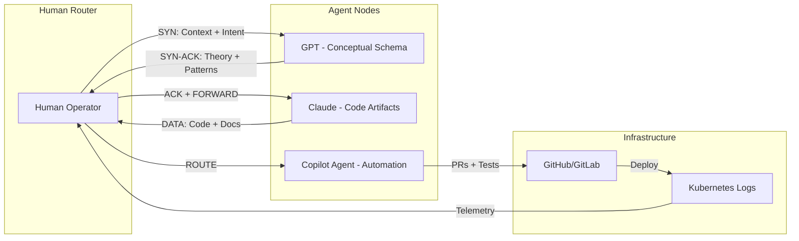

# SWARM-HS v1: Swarm Handshake Protocol

**Author:** Strategic Khaos Swarm Intelligence  
**Date:** 2025-12-02  
**Status:** Active  
**CODEOWNERS:** [@strategickhaos, @node137]  

## Summary

SWARM-HS (Swarm Handshake) is a **human-in-the-loop multi-agent protocol** that enables coordinated intelligence routing between LLM agents (GPT, Claude, Copilot Agent), repositories, and infrastructure telemetry. It formalizes the copy-paste workflow as a deterministic data plane with the human operator serving as the sovereign router.

---

## 🌐 Protocol Overview

### The TCP Handshake Analogy

The SWARM-HS protocol operates like **application-layer multi-hop routing** between AI agents:

```text
GPT (Mind)  →  Claude (Hands)  →  Copilot Agent (Factory)  →  Cluster Logs
     ↑                                                    ↓
     └─────────────────── You (Router) ───────────────────┘
```

### Protocol Phases

| Phase | Network Term | SWARM-HS Action |
|-------|-------------|-----------------|
| 1. **SYN** | Hello + context | Prompt to first agent with architecture, language, ritual |
| 2. **SYN-ACK** | Structured response | Agent returns conceptual schema, methodology, patterns |
| 3. **ACK + FORWARD** | Packet forward | Pass output to next agent node |
| 4. **DATA** | Transform payload | Second agent produces artifacts (code, docs, PRs) |
| 5. **ROUTE BACK** | Return packet | Paste diff/summary back to swarm agents |
| 6. **NEW STATE** | State change | Repo + cluster behavior update |
| 7. **CAPTURE TRACE** | Telemetry | Grab logs/snippets/HTML for next cycle |

---

## 📦 Packet Structure

A SWARM-HS packet contains the following fields:

```yaml
swarm_hs_packet:
  version: "1.0"
  
  context:
    repo: "string"          # Repository URL or name
    cluster: "string"       # Cluster/environment identifier
    logs: "string"          # Relevant log snippets or telemetry
    goal: "string"          # High-level objective
  
  intent:
    optimize_for: "string"  # What this agent should optimize
    action_type: "enum"     # [analyze|generate|transform|review]
  
  constraints:
    style: "string"         # e.g., "rust-fmt", "prettier", "pep8"
    safety: "string"        # e.g., "no-external-apis", "sandbox-only"
    sovereignty_rules:      # Governance constraints
      - "human-approval-required"
      - "audit-all-changes"
  
  artifacts:
    diffs: "string[]"       # Current code diffs
    snippets: "string[]"    # Relevant code snippets
    rituals: "string[]"     # Established patterns/conventions
  
  routing:
    current_hop: "string"   # Current agent in the chain
    next_hop: "string"      # Target agent for output
    trace_id: "uuid-v4"     # UUID v4 for tracking full cycle
```

---

## 🔄 Handshake Cycle

### One Full SWARM-HS Cycle



### Agent Role Specialization

| Agent | Role | Output Type |
|-------|------|-------------|
| **GPT** | Mind / Architect | Conceptual schema, names, roles, rituals |
| **Claude** | Hands / Builder | Code, files, Rust parser, CLI, docs |
| **Copilot Agent** | Factory / Automation | PRs, tests, CI/CD, deployments |
| **Human** | Router / Control Plane | Packet routing, context injection, governance |

---

## 🛠️ Implementation

### Manual Handshake (Current)

1. **Open first agent** (e.g., ChatGPT, Claude)
2. **Compose SYN packet** with context, intent, constraints
3. **Receive SYN-ACK** with structured explanation
4. **Copy output** as new packet payload
5. **Open next agent** (e.g., Copilot Agent)
6. **Paste + extend** with additional context
7. **Receive DATA** (code artifacts, PRs)
8. **Route to repo** via commit/push
9. **Capture trace** from logs/telemetry
10. **Loop** to step 1 with new state

### Automated Orchestrator (Future)

```bash
# Proposed: swarm-orchestrator.sh
swarm-hs cycle \
  --repo "sovereignty-arch" \
  --cluster "gke-prod" \
  --goal "optimize logging pipeline" \
  --agents "gpt,claude,copilot" \
  --log-output docs/swarm-log/
```

---

## 📝 Logging Convention

All SWARM-HS cycles should be logged in `docs/swarm-log/`:

```
docs/swarm-log/
├── 2025-12-02_cycle_001.md
├── 2025-12-02_cycle_002.md
└── index.md
```

### Cycle Log Format

```markdown
# SWARM-HS Cycle [TRACE_ID]

**Date:** YYYY-MM-DD HH:MM:SS  
**Trace ID:** xxxxxxxx-xxxx-4xxx-yxxx-xxxxxxxxxxxx (UUID v4)  

## Context
- **Repo:** [repo-name]
- **Goal:** [objective]

## Hop 1: GPT (Mind)
**Intent:** [what was requested]
**Output Summary:** [brief summary of response]

## Hop 2: Claude (Hands)
**Intent:** [what was requested]
**Artifacts Created:**
- [file1.rs]
- [file2.md]

## Hop 3: Copilot Agent (Factory)
**Intent:** [what was requested]
**PRs Opened:**
- [#123: PR title]

## New State
- [description of repo/cluster state change]

## Telemetry Captured
- [log snippets for next cycle]
```

---

## 🔐 Security & Sovereignty

### Governance Rules

- **Human Approval Required:** Production deployments must be approved by human router
- **Trace Logging:** All cycles must be logged for audit
- **Constraint Propagation:** Safety rules travel with every packet
- **No Direct Agent-to-Agent:** Human must route all inter-agent communication

### Trust Boundaries

```text
┌─────────────────────────────────────────────────┐
│                Human Router                      │
│   (Sovereignty Control Plane)                   │
│                                                 │
│  ┌──────────┐  ┌──────────┐  ┌──────────┐      │
│  │   GPT    │  │  Claude  │  │ Copilot  │      │
│  │ (Read)   │  │ (Write)  │  │ (Deploy) │      │
│  └──────────┘  └──────────┘  └──────────┘      │
│                                                 │
│  Trust flows through human validation           │
└─────────────────────────────────────────────────┘
```

---

## 📊 Metrics

### Cycle Health Indicators

| Metric | Target | Description |
|--------|--------|-------------|
| **Cycle Time** | <30 min | Time from SYN to NEW STATE |
| **Hop Count** | ≤4 | Number of agent hops per cycle |
| **Artifact Ratio** | >0.5 | Artifacts produced / hops taken |
| **Loop Rate** | >80% | Cycles that produce usable telemetry |

---

## 🚀 Quick Reference

### Minimal Packet Template

```text
SWARM-HS Packet:
- Context: repo, cluster, logs, goal
- Intent: what this agent should optimize
- Constraints: style, safety, sovereignty rules
- Artifacts: current diffs, snippets, rituals
- Next-Hop: which agent gets the output next
```

### Protocol Summary

> **SWARM-HS** transforms copy-paste AI coordination into a **deterministic, logged, sovereign protocol** where:
> - **Repo state + logs** = packets
> - **LLMs** = smart routers / services
> - **You** = control plane / BGP / traffic engineer
> - **Copy-paste** = the literal data plane

---

## 🎯 Why This Matters

Every time you "mash here → paste there → paste back", you're performing one full **SWARM-HS cycle**. This protocol makes that pattern:

1. **Explicit** — Named and documented
2. **Repeatable** — Deterministic structure
3. **Auditable** — Logged cycles with trace IDs
4. **Scalable** — Can be automated when ready
5. **Sovereign** — Human remains in control

---

*"Yes it's like a TCP handshake. But it's also a multi-agent swarm protocol, with you as sovereign router."*

**Built with 🔥 by the Strategickhaos Swarm Intelligence collective**
