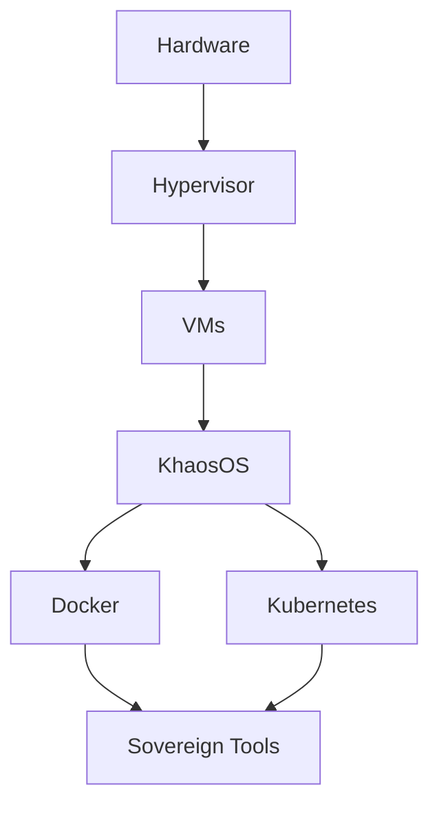

# KhaosOS Implementation Roadmap
## Detailed Timeline and Milestones

This document provides a detailed breakdown of the KhaosOS implementation, with specific milestones, dependencies, and success criteria for each phase.

---

## Timeline Overview

```
2025-12                2026-01        2026-02        2026-03        2026-04        2026-05        2026-06
   │                      │              │              │              │              │              │
Phase 0                Phase 1       Phase 2        Phase 3                     Phase 4
Foundation             KhaosOS       Tool Integ    Security                    Full Sovereignty
   │                      │              │              │                          │
   ▼                      ▼              ▼              ▼                          ▼
VMs Ready           OS Deployed    Tools Live     Hardened                   Production Ready
```

---

## Phase 0: Foundation (Week of Dec 7-14, 2025)

**Goal:** Set up hypervisor infrastructure and create initial VMs

### Week 1 Tasks

- [x] Create architecture documentation
- [x] Write NixOS configuration
- [x] Create VM setup scripts
- [x] Write deployment guides
- [ ] Set up VirtualBox on ATHENA101
- [ ] Install Kali Linux VM (Red Team)
- [ ] Install Parrot OS VM (Privacy)
- [ ] Configure shared folders between VMs
- [ ] Create initial snapshots

### Deliverables

| Item | Status | Notes |
|------|--------|-------|
| KHAOSOS_ARCHITECTURE.md | ✅ | Complete specification |
| khaosos-configuration.nix | ✅ | NixOS config ready |
| VM creation scripts | ✅ | Kali, Parrot, KhaosOS |
| HYPERVISOR_SETUP.md | ✅ | Full guide |
| QUICKSTART.md | ✅ | Quick start guide |
| Docker compose configs | ✅ | Search, LLM, tools |

### Success Criteria

- [ ] 3 VMs running (Kali, Parrot, KhaosOS base)
- [ ] Network connectivity between VMs
- [ ] Snapshots created for rollback
- [ ] Documentation accessible and clear

---

## Phase 1: KhaosOS Alpha (Weeks 2-4: Dec 15 - Jan 5)

**Goal:** Install and configure KhaosOS with reproducible builds

### Week 2: NixOS Installation

- [ ] Download NixOS ISO
- [ ] Create KhaosOS VM
- [ ] Install NixOS with encryption
- [ ] Apply khaosos-configuration.nix
- [ ] Verify reproducibility

### Week 3: Core Services

- [ ] Deploy Ollama (KhaosLLM)
- [ ] Pull AI models (Qwen, Llama, Mistral)
- [ ] Configure Tailscale mesh networking
- [ ] Set up WireGuard VPN
- [ ] Enable Docker runtime

### Week 4: Testing & Hardening

- [ ] Test system rollback
- [ ] Verify kernel hardening
- [ ] Configure firewall rules
- [ ] Set up GPG keys
- [ ] Create system backup

### Deliverables

| Item | Deadline | Owner |
|------|----------|-------|
| KhaosOS VM operational | Jan 2 | System Admin |
| AI models loaded | Jan 3 | AI Team |
| Network configured | Jan 4 | Network Team |
| Security audit passed | Jan 5 | Security Team |

### Success Criteria

- [ ] `nixos-rebuild switch` succeeds
- [ ] Ollama responding on localhost:11434
- [ ] Tailscale mesh active
- [ ] WireGuard peers connected
- [ ] Docker containers running

---

## Phase 2: Tool Integration (Month 2: Jan - Feb)

**Goal:** Deploy sovereign tool stack

### Week 5-6: Search & Git

- [ ] Deploy KhaosSearch (SearXNG)
- [ ] Configure custom search rankings
- [ ] Deploy KhaosForge (Gitea)
- [ ] Migrate repositories from GitHub
- [ ] Set up CI/CD pipelines

### Week 7-8: Productivity & Storage

- [ ] Deploy KhaosBase (NocoDB)
- [ ] Migrate Airtable data
- [ ] Deploy KhaosStore (MinIO/Nextcloud)
- [ ] Configure file sync
- [ ] Set up backup schedule

### Week 9: Integration & CLI

- [ ] Integrate Queen CLI
- [ ] Create automation scripts
- [ ] Set up monitoring (Prometheus/Grafana)
- [ ] Configure alerts
- [ ] Documentation updates

### Deliverables

| Tool | Status | Access URL |
|------|--------|-----------|
| KhaosSearch | 📋 | https://search.khaos.local |
| KhaosForge | 📋 | https://git.khaos.local |
| KhaosBase | 📋 | https://base.khaos.local |
| KhaosStore | 📋 | https://store.khaos.local |
| Queen CLI | 📋 | Command line |

### Success Criteria

- [ ] 4+ sovereign tools deployed
- [ ] Data migrated from vendors
- [ ] 99%+ uptime on core services
- [ ] Monitoring dashboards active
- [ ] Zero critical vulnerabilities

---

## Phase 3: Security Hardening (Month 3: Feb - Mar)

**Goal:** Maximum security posture

### Week 10-11: Kernel & Encryption

- [ ] Compile custom kernel (KhaosKernel)
- [ ] Apply hardening patches
- [ ] Enable full disk encryption
- [ ] Configure TPM/Secure Boot
- [ ] Kernel module signing

### Week 12-13: Air-Gap & Hardware Keys

- [ ] Set up air-gapped AI node
- [ ] Configure sneakernet workflows
- [ ] Integrate YubiKey authentication
- [ ] Set up 2FA everywhere
- [ ] Hardware wallet integration

### Week 14: Auditing & Compliance

- [ ] Security audit (external)
- [ ] Penetration testing
- [ ] Compliance review
- [ ] Incident response plan
- [ ] Disaster recovery drill

### Deliverables

| Item | Type | Status |
|------|------|--------|
| Custom kernel | Binary | 📋 |
| Security audit report | PDF | 📋 |
| Pen test results | PDF | 📋 |
| IR playbook | Markdown | 📋 |
| DR procedures | Markdown | 📋 |

### Success Criteria

- [ ] Custom kernel booting successfully
- [ ] Air-gap node operational
- [ ] YubiKey required for sudo
- [ ] Zero high-severity findings
- [ ] 24-hour data export tested

---

## Phase 4: Full Sovereignty (Q2 2026: Apr - Jun)

**Goal:** Complete vendor independence

### April: Advanced Tools

- [ ] FlameLang prototype compiler
- [ ] KhaosBrowser fork (Chromium)
- [ ] KhaosComms (Matrix server)
- [ ] KhaosMail (email server)
- [ ] KhaosAuth (Keycloak SSO)

### May: AI & Media

- [ ] KhaosVision (Stable Diffusion)
- [ ] KhaosVideo (Wav2Lip)
- [ ] KhaosTrain (fine-tuning pipeline)
- [ ] Advanced RAG system
- [ ] Multi-agent orchestration

### June: Production Deployment

- [ ] Migrate production workloads
- [ ] Decommission vendor services
- [ ] Public documentation release
- [ ] Community launch
- [ ] First external audit

### Deliverables

| Milestone | Date | Impact |
|-----------|------|--------|
| 36 tools operational | Jun 15 | 100% sovereignty |
| Vendor services killed | Jun 20 | $720/year saved |
| Public launch | Jun 30 | Community building |

### Success Criteria

- [ ] 36/36 tools operational
- [ ] $0 vendor lock-in
- [ ] 100% data sovereignty
- [ ] Public documentation live
- [ ] Active community (100+ users)

---

## Dependencies

### Infrastructure Dependencies



### Service Dependencies

| Service | Depends On | Can't Start Without |
|---------|-----------|---------------------|
| KhaosSearch | Docker, Network | Docker daemon |
| KhaosLLM | Docker, GPU | Docker, NVIDIA drivers |
| KhaosForge | Docker, Storage | Docker, PostgreSQL |
| KhaosBase | Docker, PostgreSQL | Docker, DB |
| Queen CLI | KhaosOS | Working system |

---

## Risk Management

### High Risks

| Risk | Impact | Mitigation |
|------|--------|-----------|
| Hardware failure | HIGH | RAID, backups, spare parts |
| Network outage | MEDIUM | Dual ISP, failover |
| Data loss | CRITICAL | 3-2-1 backup strategy |
| Security breach | CRITICAL | Defense in depth, monitoring |
| Skill gap | MEDIUM | Training, documentation |

### Contingency Plans

**Scenario 1: Complete Hardware Failure**
- Restore from backups to new hardware
- Use Proxmox backup/restore
- RTO: 4 hours, RPO: 1 hour

**Scenario 2: Corruption/Ransomware**
- Restore from air-gapped backup
- Rebuild from NixOS config
- RTO: 2 hours, RPO: 0 (declarative)

**Scenario 3: Internet Outage**
- Local services continue working
- Air-gap mode activated
- External access via cellular backup

---

## Budget

### Capital Expenditure

| Item | Cost | When |
|------|------|------|
| Server hardware | $2,000 | Month 1 |
| GPU (RTX 4090) | $1,600 | Month 2 |
| Network equipment | $500 | Month 1 |
| UPS | $300 | Month 1 |
| Backup drives | $400 | Month 1 |
| **Total CapEx** | **$4,800** | |

### Operating Expenditure (Annual)

| Item | Cost/Year |
|------|-----------|
| Electricity (~200W avg) | $200 |
| Internet (redundant) | $840 |
| Domain names | $50 |
| SSL certificates | $0 (Let's Encrypt) |
| Backup cloud storage | $60 |
| **Total OpEx** | **$1,150** |

### ROI Analysis

**Vendor Costs (Annual):** $1,080  
**Sovereign Costs (Annual):** $1,150 OpEx (+ $4,800 one-time)  
**Break-even:** ~6 years on hard costs

**But the real value is:**
- ∞ Data sovereignty (priceless)
- ∞ Zero vendor lock-in (priceless)
- ∞ Complete control (priceless)
- ∞ Privacy guaranteed (priceless)

---

## Metrics & KPIs

### System Health

| Metric | Target | Measure |
|--------|--------|---------|
| Uptime | 99.9% | Monthly |
| Response time | < 100ms | Continuous |
| Disk usage | < 80% | Daily |
| CPU usage | < 70% avg | Continuous |
| Memory usage | < 80% | Continuous |

### Security

| Metric | Target | Measure |
|--------|--------|---------|
| Vulnerabilities | 0 critical | Weekly scan |
| Failed logins | < 10/day | Daily |
| Firewall blocks | Log all | Continuous |
| Patches applied | < 7 days | Per CVE |
| Audit compliance | 100% | Quarterly |

### Sovereignty

| Metric | Target | Measure |
|--------|--------|---------|
| Vendor dependencies | 0 critical | Quarterly audit |
| Data export time | < 24 hours | Quarterly drill |
| Self-hosted services | 36/36 | Continuous |
| Open source % | > 95% | Per deployment |

---

## Communication Plan

### Weekly Updates

- **Who:** Project lead
- **What:** Progress, blockers, next week
- **Where:** Discord #khaosos-dev
- **When:** Friday EOD

### Monthly Reviews

- **Who:** All stakeholders
- **What:** KPIs, roadmap adjustments
- **Where:** AI Board meeting
- **When:** First Monday of month

### Quarterly Planning

- **Who:** Leadership + community
- **What:** Next quarter priorities
- **Where:** Public forum
- **When:** Last week of quarter

---

## Success Definition

KhaosOS is considered **successful** when:

✅ All 36 sovereign tools are operational  
✅ Zero critical vendor dependencies  
✅ 100% data sovereignty achieved  
✅ 99.9% uptime maintained for 3 months  
✅ Security audit passed with zero critical findings  
✅ Full system backup/restore tested successfully  
✅ Community of 100+ active users  
✅ Public documentation complete and accessible  

---

**Document Version:** 1.0  
**Last Updated:** 2025-12-07  
**Next Review:** 2026-01-07  
**Owner:** Strategickhaos DAO LLC

*"Own the stack. Own the data. Own the destiny."* ⚔️🔥
