# 🧪 Swarm Collider Engineering

**AI-driven, observability-first DevOps where traces and logs are the raw particles, and LLM agents are the analyzers that turn collisions into new code & rituals.**

*This is how Strategickhaos engineers reality.*

---

## 📖 Overview

Swarm Collider Engineering is an emergent methodology born from the intersection of:

- **Observability-Driven Development** — starting from logs & traces, not requirements documents
- **GitOps / Infrastructure-as-Code** — all changes end up as repos, PRs, scripts
- **AI-Assisted Swarm Engineering** — multiple models cooperate/compete on the same state
- **Red/Blue / Chaos Mindset** — actively watching `red-team` and `jarvis-swarm` traffic in the logs

The core insight: **you are running a particle accelerator for code**, where system traces are particles, and AI agents are the scientists reading the splashes.

---

## 🔄 The Closed Experimental Loop

```mermaid
graph LR
    A[🔬 Trace] --> B[🤖 AI]
    B --> C[📦 Code/Ritual]
    C --> D[⚙️ System]
    D --> E[📊 New Trace]
    E --> A
```



### The Five-Step Cycle

| Step | Action | Artifacts |
|------|--------|-----------|
| **1. Capture** | Capture a high-energy trace | HTML exports, log streams, heap snapshots, console noise |
| **2. Fire** | Fire it into an AI agent | Claude, GPT, Copilot analysis |
| **3. Receive** | Get back structure + code + rituals | `.gitignore`, docs, PRs, dashboards, workflows |
| **4. Deploy** | Deploy / commit / run again | New behavior appears in logs and tools |
| **5. Observe** | Capture *that* behavior | More logs, more traces, more HTML, more snapshots |

**Then repeat.**

This is literally what a particle accelerator does with matter: **slam, observe, model, tweak, slam again.**

---

## 🛠️ Tool Ecosystem

### Capture Layer
- **PyCharm** / **VS Code** — IDE with integrated debugging and console capture
- **Browser DevTools** — Console spam, network traces, heap snapshots
- **Google Cloud Observability** — Logs for `jarvis-swarm-personal-001`, `red-team`, etc.
- **GitLab Snippets** — Stashed heartbeat traces as evidence

### AI Analysis Layer
- **Claude** — Deep reasoning and code synthesis
- **GPT-4** — Multi-modal analysis and documentation
- **GitHub Copilot** — Real-time code assistance and pattern matching

### Artifact Layer
- **GitHub / GitLab** — Version-controlled code, PRs, issues
- **Kubernetes Manifests** — Infrastructure-as-Code deployments
- **Discord** — Real-time operational notifications
- **Grafana Dashboards** — Visualized observability metrics

---

## 🔍 Reading the Kubernetes Heartbeat

When you see a log wall like this:

```yaml
Kubernetes Apiservice Requests:
  method: "io.k8s.coordination.v1.leases.update"
  principals:
    - system:kube-scheduler
    - cluster-autoscaler
    - service-steering
    - red-team
    - jarvis-swarm-personal-001
```

You're seeing your **cluster's heartbeat**:

- Controllers renewing **leases**
- Autoscaler adjusting nodes
- DNS, metrics, CSI drivers, webhooks all saying "I'm alive, I hold this lock"

The Swarm Collider approach:

1. Grab that heartbeat trace
2. Stash it as a **GitLab snippet** (`Trace – jarvis-swarm-personal…`)
3. Feed it into your AI stack as *evidence* of what the swarm is doing
4. Let AI help you interpret and shape it

**You're not just coding; you're listening to the living system.**

---

## 🏛️ Architectural Philosophy

### AI-Orchestrated Recon Dojo + Sovereign Command Center

| Component | Particle Accelerator Analogy |
|-----------|------------------------------|
| Logs, HTML dumps, heap snapshots | **Particles** |
| GitHub / GitLab repos | **The Detector** |
| Claude / GPT / Copilot | **The Scientists** reading the splashes |
| New rituals, scripts, infrastructure | **Theoretical Models** turned into experiments |

### Why It Feels Like Methodology, Not Just Coding

You've built a **self-refining lab** around your own energy. Each iteration:

- Increases system understanding
- Produces new operational artifacts
- Generates fresh traces for the next cycle
- Compounds knowledge across AI agents

---

## 📐 Formal Definition

> **Swarm Collider Engineering** (n.)
>
> A closed-loop DevOps methodology where observability traces serve as experimental inputs to AI agents, which synthesize code, documentation, and operational rituals. These artifacts modify system behavior, producing new traces that drive subsequent iterations.
>
> **Characteristics:**
> - Observability-first (traces precede requirements)
> - AI-mediated synthesis (multiple agents compete/cooperate)
> - GitOps-native (all changes version-controlled)
> - Chaos-embracing (red/blue mindset integrated)
> - Self-refining (each cycle improves the next)

---

## 🚀 Implementation Guide

### Getting Started

```bash
# 1. Set up observability capture
export CLOUD_PROJECT="your-gcp-project"
gcloud logging read "resource.type=k8s_container" --limit=1000 > trace.json

# 2. Stash trace as evidence (use --secret for sensitive data)
gh gist create --secret trace.json -d "Kubernetes heartbeat $(date +%Y-%m-%d)"

# 3. Fire into AI for analysis
# (Use your preferred AI interface - Claude, GPT, etc.)
# Prompt: "Analyze this Kubernetes log trace and suggest optimizations"

# 4. Deploy generated artifacts
git add .
git commit -m "chore: apply swarm collider iteration $(date +%s)"
git push

# 5. Capture new behavior
kubectl logs -f deployment/my-service | tee new_trace.log
```

### Best Practices

1. **Capture Aggressively** — More data gives AI more to work with
2. **Version Everything** — Every trace, every artifact, every ritual
3. **Trust But Verify** — AI suggestions need human review before production
4. **Embrace Chaos** — Red team traces are just as valuable as green
5. **Close the Loop** — Always capture the effects of your changes

---

## 🎯 Success Metrics

| Metric | Description | Target |
|--------|-------------|--------|
| **Cycle Time** | Time from trace capture to deployed artifact | < 30 minutes |
| **AI Utilization** | Percentage of changes informed by AI analysis | > 70% |
| **Trace Coverage** | Percentage of system components generating observable traces | > 90% |
| **Ritual Documentation** | Percentage of operational procedures codified | > 80% |
| **Loop Closure Rate** | Percentage of deployments with follow-up observation | 100% |

---

## 📚 Related Concepts

- **Observability-Driven Development** — Starting development from observability requirements
- **GitOps** — Git as the single source of truth for infrastructure
- **AIOps** — Applying AI/ML to IT operations
- **Chaos Engineering** — Deliberately introducing failures to test resilience
- **DevSecOps** — Integrating security into the DevOps pipeline

---

## 🔮 Future Evolution

The Swarm Collider methodology is designed to evolve. As AI capabilities improve:

- **Autonomous Loop Closure** — AI agents that can observe, analyze, and deploy without human intervention
- **Cross-System Learning** — Patterns from one cluster informing another
- **Predictive Collisions** — AI suggesting experiments before traces indicate problems
- **Distributed Swarm Intelligence** — Multiple AI agents specializing in different trace types

---

*"This is Particle Accelerator Time."*

*— Strategickhaos Swarm Intelligence*

---

**Built with 🔥 by the Strategickhaos collective**

*In the collision of traces and intelligence lies infinite opportunity for those who know how to look.*
