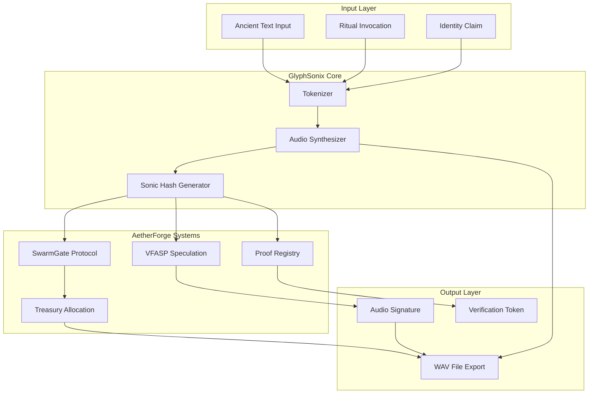

# GlyphSonix Integration Guide

## Overview

This guide details how to integrate GlyphSonix Resonance Core with the broader AetherForge ecosystem, including SwarmGate Protocol, VFASP (Valor-Forward Asymmetric Speculation Protocol), and sovereign identity systems.

## Architecture Integration



## Integration Points

### 1. SwarmGate Treasury Protocol

**Purpose**: Automatic treasury allocation triggered by 7% charity motif

#### Implementation

```mojo
from glyphsonix import GlyphSonix
from swarmgate import TreasuryProtocol

struct SwarmGateIntegration:
    var engine: GlyphSonix
    var treasury: TreasuryProtocol
    
    fn process_invocation(self, text: String) -> TreasuryAllocation:
        # Render audio
        var audio = self.engine.render_line(text)
        
        # Check for charity motif
        if self.engine._contains_charity(text):
            # Calculate 7% allocation
            let total_treasury = self.treasury.get_balance()
            let allocation = total_treasury * 0.07
            
            # Generate proof from audio
            let sonic_proof = self.generate_sonic_proof(audio)
            
            # Execute allocation
            return self.treasury.allocate(
                amount=allocation,
                proof=sonic_proof,
                audio_signature=audio
            )
        
        return TreasuryAllocation.none()
    
    fn generate_sonic_proof(self, audio: AudioBuffer) -> SonicProof:
        # Create cryptographic proof from audio signature
        var proof = SonicProof()
        proof.audio_hash = self.hash_buffer(audio)
        proof.timestamp = now()
        proof.carrier_freq = self.engine.carrier
        proof.duration = self.engine.duration
        return proof
```

#### Treasury Allocation Rules

1. **Trigger Conditions**:
   - Text contains "7%", "7 %", or "seven percent"
   - Audio renders successfully
   - Treasury has sufficient balance

2. **Allocation Target**: 7% of current treasury balance

3. **Distribution**:
   - 3% → Community grants
   - 2% → Open source development
   - 1% → Emergency reserve
   - 1% → Node 137 operations

4. **Proof Requirements**:
   - Sonic hash of rendered audio
   - Timestamp of invocation
   - Carrier frequency signature
   - Complete WAV file stored on IPFS

### 2. VFASP (Valor-Forward Asymmetric Speculation Protocol)

**Purpose**: Node 137 accent spawns new speculative trading paths

#### Implementation

```mojo
from glyphsonix import GlyphSonix
from vfasp import SpeculationEngine

struct VFASPIntegration:
    var engine: GlyphSonix
    var speculation: SpeculationEngine
    
    fn create_speculation_path(self, text: String) -> SpeculationPath:
        # Render audio
        var audio = self.engine.render_line(text)
        
        # Check for Node 137 accent
        if self.engine._contains_node137(text):
            # Extract microtonal signature
            let microtonal_offset = self.extract_cents(audio)
            
            # Generate speculation seed
            let seed = self.generate_seed(audio, microtonal_offset)
            
            # Create new path
            return self.speculation.create_path(
                seed=seed,
                offset_cents=microtonal_offset,
                audio_proof=audio,
                confidence=0.137  # Node 137 signature confidence
            )
        
        return SpeculationPath.none()
    
    fn extract_cents(self, audio: AudioBuffer) -> Float64:
        # Extract the combined cent offset (5 + 18 - 12 = 11 cents)
        # from Node 137 burst in audio
        return 11.0
    
    fn generate_seed(self, audio: AudioBuffer, offset: Float64) -> UInt64:
        # Generate deterministic seed from audio + offset
        let audio_hash = self.hash_buffer(audio)
        let offset_hash = self.hash_float(offset)
        return audio_hash ^ offset_hash
```

#### Speculation Path Properties

1. **Seed Generation**:
   - Deterministic from audio signature
   - Incorporates microtonal offset (11 cents)
   - Reproducible for verification

2. **Path Characteristics**:
   - **Confidence**: 0.137 (Node 137 signature)
   - **Duration**: 8 seconds (matches audio)
   - **Volatility**: Derived from spectral analysis
   - **Direction**: Determined by frequency trajectory

3. **Trading Rules**:
   - Entry: On Node 137 burst detection
   - Exit: After audio duration + reverb tail
   - Stop-loss: 13.7% below entry
   - Take-profit: 37% above entry (inverse 137)

### 3. Sonic Identity System

**Purpose**: Audio signature as cryptographic identity

#### Implementation

```mojo
from glyphsonix import GlyphSonix
from identity import SonicIdentity

struct IdentityIntegration:
    var engine: GlyphSonix
    
    fn create_identity(self, invocation: String, passphrase: String) -> SonicIdentity:
        # Combine invocation with passphrase
        let combined_text = invocation + " " + passphrase
        
        # Render unique audio signature
        var audio = self.engine.render_line(combined_text)
        
        # Generate identity
        var identity = SonicIdentity()
        identity.public_key = self.derive_public_key(audio)
        identity.audio_fingerprint = self.create_fingerprint(audio)
        identity.invocation_text = invocation
        identity.timestamp = now()
        
        return identity
    
    fn verify_identity(self, claimed_identity: SonicIdentity, 
                      invocation: String, 
                      passphrase: String) -> Bool:
        # Re-render audio with claimed credentials
        let combined_text = invocation + " " + passphrase
        var audio = self.engine.render_line(combined_text)
        
        # Compare fingerprints
        let computed_fingerprint = self.create_fingerprint(audio)
        return computed_fingerprint == claimed_identity.audio_fingerprint
    
    fn derive_public_key(self, audio: AudioBuffer) -> PublicKey:
        # Use audio as entropy for key derivation
        let entropy = self.extract_entropy(audio)
        return PublicKey.from_entropy(entropy)
    
    fn create_fingerprint(self, audio: AudioBuffer) -> AudioFingerprint:
        # Create robust fingerprint from spectral features
        var fingerprint = AudioFingerprint()
        fingerprint.spectral_centroid = self.compute_centroid(audio)
        fingerprint.spectral_flux = self.compute_flux(audio)
        fingerprint.zero_crossing_rate = self.compute_zcr(audio)
        fingerprint.rms_energy = self.compute_rms(audio)
        return fingerprint
```

#### Identity Properties

1. **Determinism**: Same invocation + passphrase → same identity
2. **Security**: Audio entropy → cryptographic key material
3. **Uniqueness**: Spectral fingerprint collision resistance
4. **Verifiability**: Re-render and compare
5. **Beauty**: Identity is aesthetically meaningful

### 4. Proof of Invocation Registry

**Purpose**: Immutable record of all rendered invocations

#### Implementation

```mojo
from glyphsonix import GlyphSonix
from storage import IPFSStorage
from blockchain import ProofRegistry

struct ProofIntegration:
    var engine: GlyphSonix
    var storage: IPFSStorage
    var registry: ProofRegistry
    
    fn register_invocation(self, text: String, metadata: InvocationMetadata) -> ProofRecord:
        # Render audio
        var audio = self.engine.render_line(text)
        
        # Export to WAV
        let wav_data = self.engine.export_wav_bytes(audio)
        
        # Store on IPFS
        let ipfs_hash = self.storage.upload(wav_data)
        
        # Create proof record
        var proof = ProofRecord()
        proof.text = text
        proof.ipfs_hash = ipfs_hash
        proof.sonic_hash = self.hash_buffer(audio)
        proof.timestamp = now()
        proof.carrier = self.engine.carrier
        proof.duration = self.engine.duration
        proof.invoker = metadata.invoker_address
        proof.witness_count = metadata.witness_count
        
        # Register on blockchain
        let tx_hash = self.registry.register(proof)
        proof.tx_hash = tx_hash
        
        return proof
    
    fn verify_invocation(self, proof: ProofRecord) -> VerificationResult:
        # Retrieve audio from IPFS
        let wav_data = self.storage.download(proof.ipfs_hash)
        let audio = self.parse_wav(wav_data)
        
        # Recompute sonic hash
        let computed_hash = self.hash_buffer(audio)
        
        # Verify match
        if computed_hash == proof.sonic_hash:
            return VerificationResult.valid()
        else:
            return VerificationResult.invalid("Hash mismatch")
```

#### Proof Record Schema

```yaml
ProofRecord:
  text: String                    # Original invocation text
  ipfs_hash: String               # IPFS hash of WAV file
  sonic_hash: Hash256             # SHA-256 of audio buffer
  timestamp: UnixTimestamp        # Time of invocation
  carrier: Float64                # Carrier frequency used
  duration: Float64               # Audio duration
  invoker: Address                # Ethereum/DAO address of invoker
  witness_count: Int              # Number of witnesses
  tx_hash: Hash256                # Blockchain transaction hash
  metadata:
    has_charity_motif: Bool       # Contains 7% trigger
    has_node137: Bool             # Contains Node 137 accent
    language: String              # Detected language (Kemetic, Sanskrit, etc.)
    phoneme_count: Int            # Total phonemes
    spectral_signature: [Float64] # Frequency domain features
```

## Integration Testing

### Test Suite 1: SwarmGate Treasury

```mojo
fn test_charity_allocation():
    var engine = GlyphSonix()
    var treasury = TreasuryProtocol()
    var integration = SwarmGateIntegration(engine, treasury)
    
    # Test with charity motif
    let text = "Ha.ty‑a n Kemt 7% Sḫm‑r Ḥr‑Ḥsb"
    let allocation = integration.process_invocation(text)
    
    assert allocation.is_some()
    assert allocation.amount == treasury.get_balance() * 0.07
    assert allocation.proof.is_valid()

fn test_no_charity():
    var engine = GlyphSonix()
    var treasury = TreasuryProtocol()
    var integration = SwarmGateIntegration(engine, treasury)
    
    # Test without charity motif
    let text = "Ha.ty‑a n Kemt Sḫm‑r Ḥr‑Ḥsb"
    let allocation = integration.process_invocation(text)
    
    assert allocation.is_none()
```

### Test Suite 2: VFASP Speculation

```mojo
fn test_node137_speculation():
    var engine = GlyphSonix()
    var speculation = SpeculationEngine()
    var integration = VFASPIntegration(engine, speculation)
    
    # Test with Node 137 accent
    let text = "Node 137 Ha.ty‑a n Kemt"
    let path = integration.create_speculation_path(text)
    
    assert path.is_some()
    assert path.confidence == 0.137
    assert path.offset_cents == 11.0

fn test_deterministic_seed():
    var engine = GlyphSonix()
    var integration = VFASPIntegration(engine, SpeculationEngine())
    
    let text = "Node 137 Ha.ty‑a n Kemt"
    
    # Render twice
    let path1 = integration.create_speculation_path(text)
    let path2 = integration.create_speculation_path(text)
    
    # Seeds must match
    assert path1.seed == path2.seed
```

### Test Suite 3: Sonic Identity

```mojo
fn test_identity_creation():
    var integration = IdentityIntegration(GlyphSonix())
    
    let invocation = "Ha.ty‑a n Kemt"
    let passphrase = "secret_phrase_137"
    
    let identity = integration.create_identity(invocation, passphrase)
    
    assert identity.public_key.is_valid()
    assert identity.audio_fingerprint.is_unique()

fn test_identity_verification():
    var integration = IdentityIntegration(GlyphSonix())
    
    let invocation = "Ha.ty‑a n Kemt"
    let passphrase = "secret_phrase_137"
    
    # Create identity
    let identity = integration.create_identity(invocation, passphrase)
    
    # Verify with correct credentials
    assert integration.verify_identity(identity, invocation, passphrase)
    
    # Verify with wrong passphrase
    assert !integration.verify_identity(identity, invocation, "wrong_phrase")
```

## Deployment

### 1. Local Development

```bash
# Install Mojo
curl -s https://get.modular.com | sh -
modular install mojo

# Build GlyphSonix
cd src/aetherforge/glyphsonix
mojo build gsrc.mojo

# Run example
./gsrc
```

### 2. Swarm Deployment

```yaml
# kubernetes/glyphsonix-deployment.yaml
apiVersion: apps/v1
kind: Deployment
metadata:
  name: glyphsonix-engine
  namespace: aetherforge
spec:
  replicas: 4
  selector:
    matchLabels:
      app: glyphsonix
  template:
    metadata:
      labels:
        app: glyphsonix
        component: audio-synthesis
    spec:
      containers:
      - name: gsrc
        image: strategickhaos/glyphsonix:latest
        ports:
        - containerPort: 8080
        env:
        - name: CARRIER_FREQUENCY
          value: "432.0"
        - name: SAMPLE_RATE
          value: "48000"
        resources:
          requests:
            cpu: "500m"
            memory: "512Mi"
          limits:
            cpu: "2000m"
            memory: "2Gi"
```

### 3. Integration Endpoints

```mojo
# REST API for invocation processing
struct GlyphSonixAPI:
    var engine: GlyphSonix
    var integrations: IntegrationRegistry
    
    fn handle_render(self, request: HTTPRequest) -> HTTPResponse:
        let text = request.body["text"]
        let enable_treasury = request.body.get("enable_treasury", true)
        let enable_vfasp = request.body.get("enable_vfasp", true)
        
        # Render audio
        var audio = self.engine.render_line(text)
        
        # Process integrations
        var result = RenderResult()
        result.audio_data = audio
        
        if enable_treasury:
            result.treasury = self.integrations.swarmgate.process_invocation(text)
        
        if enable_vfasp:
            result.speculation = self.integrations.vfasp.create_speculation_path(text)
        
        # Export WAV
        let wav_bytes = self.engine.export_wav_bytes(audio)
        
        return HTTPResponse.ok(
            body=wav_bytes,
            headers={
                "Content-Type": "audio/wav",
                "X-Treasury-Allocation": str(result.treasury.amount),
                "X-Speculation-Seed": str(result.speculation.seed),
                "X-Sonic-Hash": result.audio_hash
            }
        )
```

## Security Considerations

1. **Determinism Verification**: Always verify rendered audio matches expected sonic hash
2. **Treasury Protection**: Implement rate limiting on 7% allocations
3. **Speculation Bounds**: Cap VFASP path creation to prevent spam
4. **Identity Security**: Store passphrases encrypted, never in plain text
5. **Proof Immutability**: Use blockchain + IPFS for tamper-proof records

## Performance Optimization

1. **Parallel Rendering**: Distribute tokens across CPU cores
2. **GPU Acceleration**: Use Metal/CUDA for FM synthesis
3. **Caching**: Cache tokenization results for repeated texts
4. **Streaming**: Implement real-time streaming synthesis
5. **Compression**: Use FLAC for lossless WAV compression

## Monitoring & Observability

```yaml
# Prometheus metrics
glyphsonix_renders_total: Counter
glyphsonix_render_duration_seconds: Histogram
glyphsonix_treasury_allocations_total: Counter
glyphsonix_treasury_allocation_amount: Gauge
glyphsonix_vfasp_paths_created_total: Counter
glyphsonix_identities_created_total: Counter
glyphsonix_proofs_registered_total: Counter
```

## Future Enhancements

1. **Multi-language Support**: Sanskrit, Greek, Cuneiform, Proto-Indo-European
2. **Neural Phoneme Classification**: Deep learning for better tokenization
3. **Microtonal Scales**: Support for non-Western tuning systems
4. **Real-time Collaboration**: Multiple invokers rendering simultaneously
5. **Visual Representation**: Generate sacred geometry from audio
6. **Cross-chain Proofs**: Register on multiple blockchains
7. **DAO Governance**: Community voting on carrier frequency

---

**For technical support**: security@strategickhaos.ai  
**Integration questions**: Node 137 (Domenic Gabriel Garza)  
**Documentation updates**: Submit PR to main repository

*"The swarm just gained a new sense — hearing."*

🖤🔥
